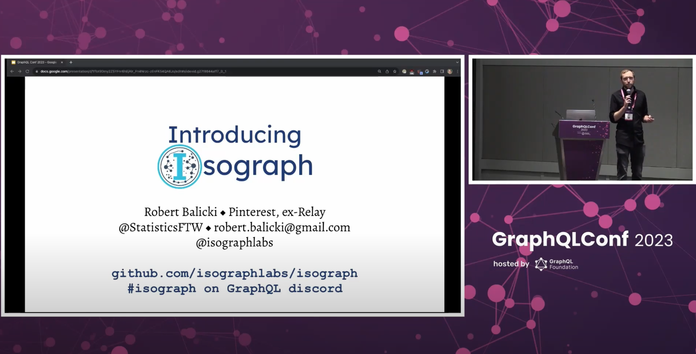

# Isograph

> The best way to build React apps backed by GraphQL data

- Watch the [talk at GraphQL Conf](https://www.youtube.com/watch?v=gO65JJRqjuc).



- Join the discord: https://discord.gg/Q2c5tM5T8A (#isograph channel on the GraphQL discord.)
- [Follow the official twitter account](https://twitter.com/isographlabs)

## About Isograph

### What is Isograph, and what are resolvers?

Isograph is a framework for building React applications that are backed by GraphQL data. In Isograph, components that read data can be selected from the graph, and automatically have the data they require passed in. Consider this example avatar component:

```js
export const avatar = iso`
  User.avatar @component {
    name,
    avatar_url,
  }
`(function Avatar({ data, ...otherRuntimeProps }) {
  return <CircleImage image={data.avatar_url} />;
});
```

This avatar component is available on any GraphQL User. You might use this avatar component in another component, such as a button that navigates to a given user's profile.

```js
export const user_profile_button = iso`
  User.user_profile_button @component {
    # the avatar can be directly selected from the Graph!
    id,
    avatar,
    name,
  }
`(function UserProfileButton({ data }) {
  return (
    <Button onClick={() => navigateToUserProfile(data.id)}>
      {data.name}
      {data.avatar({})}
    </Button>
  );
});
```

These calls to `iso` define resolvers, which are functions from graph data (such as the user's name) to an arbitrary value. With Isograph, it's resolvers all the way down — almost your entire app can be built in this way!

### How does Isograph fetch data?

At the root of each page, every app will have an `iso` literal with an `@fetchable` directive. Isograph's compiler finds and processes all the `iso` literals in your codebase, and will take any fetchable literals and generate GraphQL queries from them.

So, if the compiler encountered the following fetchable literal:

```js
iso`
  Query.user_list_page @fetchable {
    header,
    user_list_table,
    footer,
  }
`;
```

It would combine the dependencies of the `Query.header`, `Query.home_page_body` and `Query.footer` resolvers, and generate a query text. Then, when the user navigates ot the user list page, that query would be executed.

For example, the data might be fetched during render as follows:

```js
const UserListPageQuery = require("./__isograph/Query/user_list_page.isograph");

function UserListPageRoute() {
  const { queryReference } = isograph.useLazyReference(UserListPageQuery);
  const data = read(queryReference);

  return (
    <>
      {data.header}
      {data.body}
      {data.footer}
    </>
  );
}
```

> Note that the call to `read(queryReference)` will suspend if the required data is not present in the store, so make sure that either `UserListPageRoute` is wrapped in a `React.Suspense` boundary, or that the `queryReference` is passed to `read` in a child component that is wrapped by `React.Suspense`!

Now, when `UserListPageRoute` is initially rendered, Isograph will make an API call.

### How do components receive their data?

You may have noticed that when we called `data.avatar({})`, we did not pass the data that the avatar needs! Instead, when the component is rendered, Isograph will `read` the data that the avatar component needs, and pass it to `Avatar`. The calling component:

- only passes additional props that don't affect the query data, like `onClick`, and
- does **not** know what data `Avatar` expects, and never sees the data that `Avatar` reads out. This is called **data masking**, and it's a crucial reason that teams of multiple developers can move quickly when building apps with Isograph: because no component sees the data that another component selected, changing one component cannot affect another!

### Big picture

At the root of a page, you will define a fetchable literal. For any given fetchable literal, Isograph will:

- Recursively walk it's dependencies and create a single GraphQL query that fetches **all** of the data reachable from this literal.
- When that page renders, or possibly sooner, Isograph will make the API call to fetch that data.
- Each resolver will independently read the data that it specifically required.

## Getting involved and learning more

- Join the discord: https://discord.gg/Q2c5tM5T8A (#isograph channel on the GraphQL discord.)
- [Follow the official twitter account](https://twitter.com/isographlabs)

## Other, older resources

- See [the developer experience of using Isograph](https://www.youtube.com/watch?v=f1nfXc3VeTk).
- Read [the substack article](https://isograph.substack.com/p/introducing-isograph).
